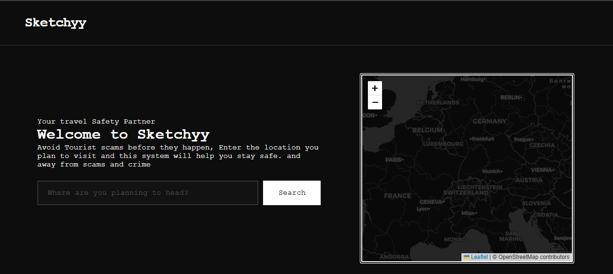
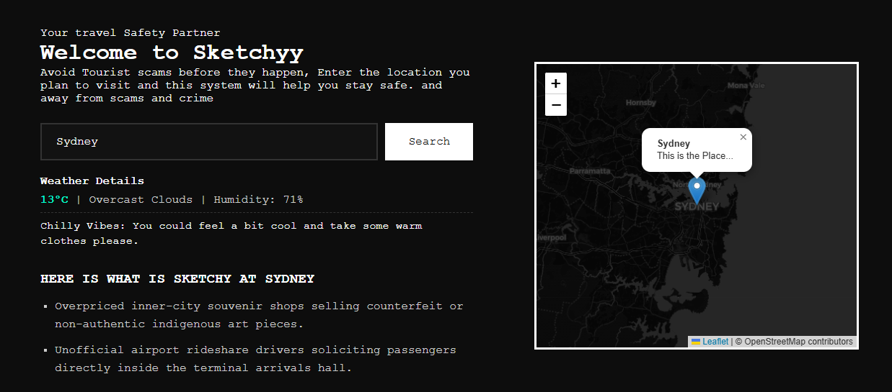

# Sketchyy

Sketchyy is a tool I made for travellers, Where this is like a scam shield for them which they can use to find the latest scams and crime in the place which they are about visit along with some other features like Weather and Map of that place :D

Here is an Image of it :D

Playable at: https://sketchyy-app.vercel.app/

## Features

* Scam Database (Collection of scam reports present online about famous places)
* Travel tips (Gives you recent weather and other atmospheric details)
* Minimal to use site ui

## Built with help from

* HTML
* CSS
* JS, Git and VS code

This is my submission for the ysws Off-track (HACK CLUB)

Thanks for your time :D
